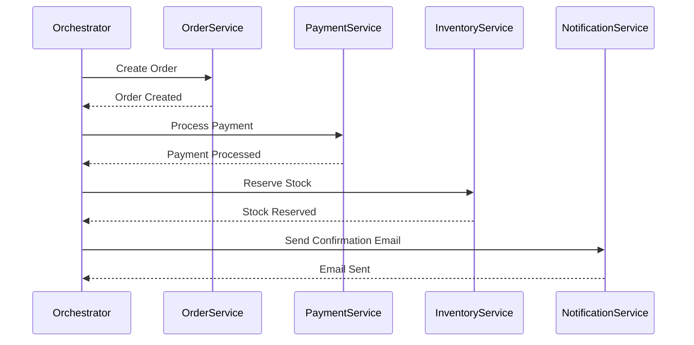

# nodejs_demo-orchestrator-based-saga
Demo how to build Orchestrator-Based Saga by Node.js

# Demo Orchestrator-Based Saga in Node.js
This repo demo how to build Orchestrator-Based Saga in Node.js

## Introduce

In the Orchestrator-Based Saga, a central orchestrator service manages transactions across multiple microservices. It ensures that each step is executed in sequence and handles compensations if a step fails. Below is a complete implementation example of an E-commerce Order Management System in Node.js.

## Scenario: 

E-commerce Order Management System:

- `Orchestrator`: Manages the saga, coordinating between all services.
- `Order Service`: Handles order creation.
- `Payment Service`: Processes payments.
- `Inventory Service`: Reserves stock.
- `Notification Service`: Sends order confirmation notifications.

##



## Start Services

### Setup Docker and run RabbitMQ as a docker container

```
docker pull rabbitmq
docker run -d --hostname rabbitmq --name rabbitmq -p 5672:5672 rabbitmq
```

### Install package
```
npm i
```

### Run services
```
node inventory_service.js
node payment_service.js
node notification_service.js
node order_service.js
node orchestrator_service.js
```

OR
```
npm start
```